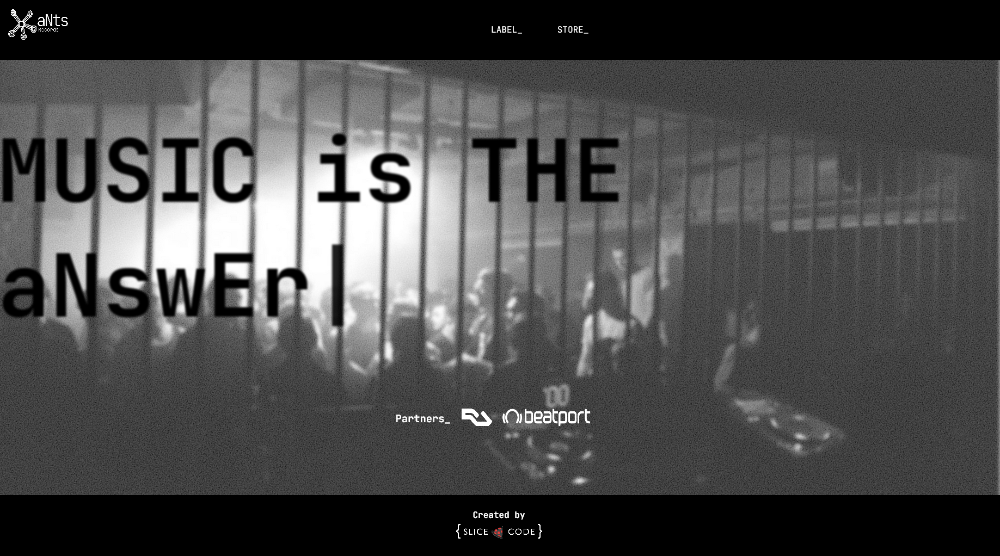
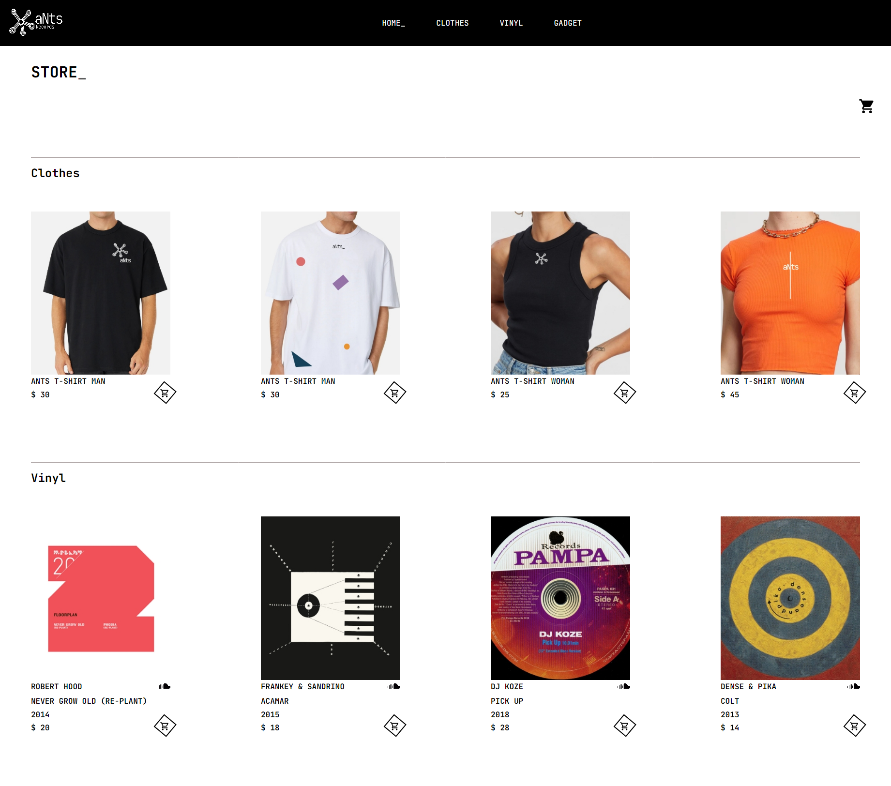

# Ants Store

## Overview
Front end e-commerce

### Screenshot

### Links

- Live Site URL: [aNts_Store](https://ants-records.netlify.app/)

## My process

I started the process of creating my shop starting from the layout design using AdobeXd.
I researched the logo by taking an Australian Aboriginal symbol and used it to create and customize the products in the shop.

After completing the design phase, I moved on to learning and creating a simple API that contained all the details / data of the store that would be collected through the use of React-Query, a new interesting tool to better manage the data.

The whole project was carried out with the sole purpose of practicing using React and TypeScript.

### Built with

- [React](https://reactjs.org/) 
- [Typescript](https://www.typescriptlang.org/) 
- [React Query](https://react-query.tanstack.com/) 

- [Framer Motion](https://www.framer.com/motion/) - For Animation
- [Styled Components](https://styled-components.com/) - For style
- [Material UI](https://nextjs.org/) - For style

### Useful resources

Api Used:

- [Ants Api Store](https://ants-store-api.herokuapp.com/) - Api that I've created for store the data for the store.

Npm Used:

- [React Scroll](https://www.npmjs.com/package/react-scroll)

## Author

- Website - [Diego Massarini](https://diego-slicecode.dev/)
- Twitter - [@slicecodediego](https://twitter.com/slicecodediego)